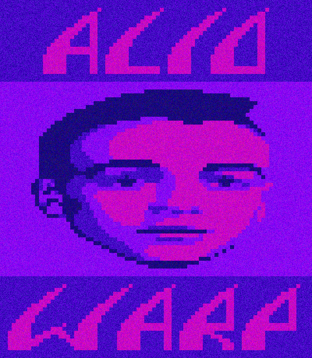

# Acid Warp for Android

- [Google Play Store Link](https://play.google.com/store/apps/details?id=com.dermochelys.acidwarp)
- Supports [Android TV](https://www.android.com/tv/) / [Google TV](https://tv.google/) devices running Android 10+.
  - While the app also can run on tablets and phones, due to high CPU usage it is currently thought to be not wise to allow users on battery-powered devices to run the app as it may fairly quickly drain their battery.
  - Additionally, a large screen is arguably the best way to experience the visualizations. 

## Technical Details
- Based on a [fork](https://github.com/Dermochelys/acidwarp) of [dreamlayers/acidwarp](https://github.com/dreamlayers/acidwarp), which is embedded as a [submodule](app/jni/src).
- See the [README.md](app/jni/src/README.md) inside the [submodule](app/jni/src).

## Building

Build the app by running `./gradlew build`. Version 3 of the [SDL library](https://github.com/libsdl-org/SDL/releases)
is required, and is included as an `.aar` file in [app/libs](app/libs).

Most build dependencies are dynamically loaded, however, you must also ensure that some dependencies are preloaded via `Tools > SDK Manager` in Android Studio, or using [sdkmanager](https://developer.android.com/tools/sdkmanager):
- `cmake` with version matching that inside of [build.gradle](app/build.gradle)
- `Android SDK Tools` with version matching that of `buildToolsVersion`, found in [build.gradle](app/build.gradle)

## Known issues
-  It appears that there is some aspect ratio correction that can be done. The animations appear slightly "squished" when viewed on fullscreen on a 16:9 display. This also affects previous ports.

## Previous versions
- See the [README.md](app/jni/src/README.md) inside the [submodule](app/jni/src).

## License

As this is a descendent of Steven Will's `AcidWarp for Linux` which was GPL licensed, this too
is and must also be GPL licensed.  See [gpl-3.0.md](gpl-3.0.md)

